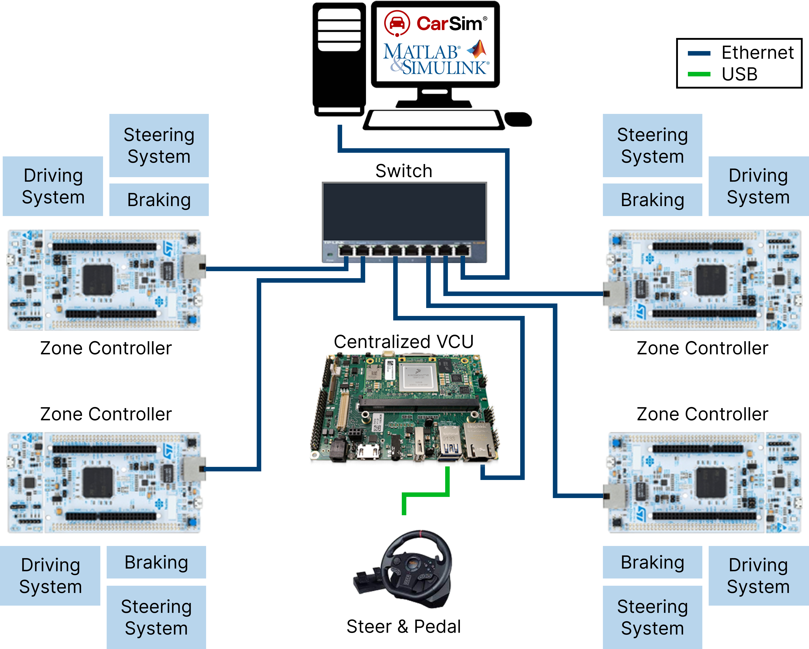
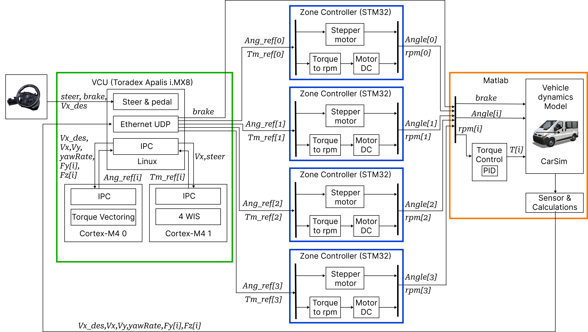

# SDV VCU HIL - Hardware-in-the-Loop Simulation for Software-Defined Vehicle VCU

Hardware-in-the-Loop (HIL) test bench for a centralized **Vehicle Control Unit (VCU)** implementing **4-Wheel Independent Steering (4WIS)** and **Torque Vectoring**, validated in real time against a **CarSim** vehicle dynamics model driven by **MATLAB/Simulink**.

---

## 1. Overview

A **Software-Defined Vehicle (SDV)** HIL test bench that validates a centralized VCU's motion-control algorithms against a physics-accurate vehicle model:

- A driver (steering wheel + pedal set) provides real-time input to the VCU.
- The VCU computes per-wheel steering angle and torque commands.
- Four zone controllers (STM32) actuate a stepper motor (steering) and DC motor (traction) per corner, and report back actual angle/speed.
- CarSim/MATLAB consumes that feedback, simulates the resulting vehicle motion and tire forces, and sends vehicle state back to the VCU closing the loop.

**Branches**
- `main` : all control logic (Torque Vectoring + 4WIS) runs on Linux, on the VCU's main core. No Cortex-M needed.
- `ipc` : control logic offloaded to the two Cortex-M4 cores (core 0 = Torque Vectoring, core 1 = 4WIS), communicating with Linux over RPMsg/IPC.

---

## 2. Hardware Topology



---

## 3. Data Flow



---

## 4. Communication

UDP frames are `__attribute__((packed))` C structs defined in `main.h`, shared with the Cortex-M4 firmware. IPC frames go over RPMsg character devices (`/dev/rpmsg0` = core 0, `/dev/rpmsg1` = core 1).

### 4.1 Endpoints

| Node | Address | Port | Direction |
|------|---------|------|-----------|
| VCU (Linux, `rx_vcu`) | — | `VCU_PORT` = 5055 | Listens for frames from MATLAB |
| MATLAB (Host PC) | `10.252.62.212` | `MATLAB_PORT` = 4093 | Receives frames from VCU |
| Zone Controller FL | `10.252.62.51` | 5051 | Receives frames from VCU |
| Zone Controller FR | `10.252.62.52` | 5052 | Receives frames from VCU |
| Zone Controller RL | `10.252.62.53` | 5053 | Receives frames from VCU |
| Zone Controller RR | `10.252.62.54` | 5054 | Receives frames from VCU |

### 4.2 Steer & Pedal → VCU (USB)

Read by `thread_steer_reader`, buffered as `steer_sample_t`.

| Field | Type | Description |
|-------|------|--------------|
| `brake` | `uint8_t` | Brake pedal input |
| `accel` | `uint16_t` | Accelerator input, used downstream as `Vx_des` (desired speed) |
| `steer` | `int16_t` | Steering wheel angle |
| `ts` | `struct timespec` | Sample timestamp (`CLOCK_MONOTONIC_RAW`) |

### 4.3 MATLAB → VCU (UDP, `matlab_recv_frame_t`)

Sent by CarSim/MATLAB to `VCU_PORT` (5055). Identified by `header = MATLAB_FRAME_HEADER (0xAC)` and `id = MATLAB_FRAME_ID (0x05)`.

| Field | Type | Description |
|-------|------|--------------|
| `header` | `uint8_t` | Frame header, `0xAC` |
| `id` | `uint8_t` | Frame id, `0x05` |
| `Vx` | `uint16_t` | Vehicle longitudinal velocity |
| `Vy` | `uint16_t` | Vehicle lateral velocity |
| `angWheel` | `uint16_t[4]` | Actual wheel steering angle per corner |
| `yawRate` | `uint16_t` | Vehicle yaw rate |
| `Fy` | `uint32_t[4]` | Lateral tire force per corner |
| `Fz` | `uint32_t[4]` | Vertical tire force per corner |
| `Vx_wheel` | `uint16_t[4]` | Wheel longitudinal velocity per corner |
| `seq` | `uint8_t` | Sequence number |

### 4.4 VCU → MATLAB — Brake (UDP, `vcu_brake_matlab_frame_t`)

Sent by the VCU to MATLAB (`10.252.62.212:4093`). Identified by `header = MATLAB_BRAKE_HEADER (0xCA)` and `id = MATLAB_BRAKE_ID (0x06)`.

| Field | Type | Description |
|-------|------|--------------|
| `header` | `uint8_t` | Frame header, `0xCA` |
| `id` | `uint8_t` | Frame id, `0x06` |
| `brake` | `uint8_t` | Brake value forwarded from the driver's Steer & Pedal input |
| `seq` | `uint8_t` | Sequence number |

### 4.5 VCU → Zone Controller (UDP, `corner_send_frame_t`)

Sent per-corner to each Zone Controller's IP/port (see §4.1). Identified by `header = CORNER_FRAME_HEADER (0xCB)`.

| Field | Type | Description |
|-------|------|--------------|
| `header` | `uint8_t` | Frame header, `0xCB` |
| `id` | `uint8_t` | Corner id (1 = FL, 2 = FR, 3 = RL, 4 = RR) |
| `Tm_ref` | `uint16_t` | Torque reference for this corner (from Torque Vectoring result) |
| `Vx` | `uint16_t` | Vehicle longitudinal velocity |
| `Vx_wheel` | `uint16_t` | Wheel longitudinal velocity for this corner |
| `Vx_des` | `uint16_t` | Driver-requested longitudinal speed |
| `Ang_ref` | `uint16_t` | Steering angle reference for this corner (from 4WIS result) |
| `Mzd` | `uint32_t` | Desired yaw moment (from Torque Vectoring result) |
| `seq` | `uint8_t` | Sequence number |

### 4.6 VCU (Linux) ↔ Cortex-M4 Core 0 — Torque Vectoring (IPC, `/dev/rpmsg0`)

**Linux → Core 0** (`rpmsg_tv_in_t`):

| Field | Type | Description |
|-------|------|--------------|
| `Vx_des` | `uint16_t` | Driver-requested longitudinal speed |
| `Vx` | `uint16_t` | Vehicle longitudinal velocity |
| `Vy` | `uint16_t` | Vehicle lateral velocity |
| `angWheel` | `uint16_t[4]` | Actual wheel steering angle per corner |
| `yawRate` | `uint16_t` | Vehicle yaw rate |
| `Fy` | `uint32_t[4]` | Lateral tire force per corner |
| `Fz` | `uint32_t[4]` | Vertical tire force per corner |

**Core 0 → Linux** (`rpmsg_tv_out_t`):

| Field | Type | Description |
|-------|------|--------------|
| `Tm_ref` | `uint16_t[4]` | Torque reference per corner |
| `Mzd` | `uint32_t` | Desired yaw moment |

### 4.7 VCU (Linux) ↔ Cortex-M4 Core 1 — 4WIS (IPC, `/dev/rpmsg1`)

**Linux → Core 1** (`rpmsg_fwis_in_t`):

| Field | Type | Description |
|-------|------|--------------|
| `steer_angle` | `uint16_t` | Driver steering wheel angle (offset-encoded) |
| `Vx` | `uint16_t` | Vehicle longitudinal velocity |

**Core 1 → Linux** (`rpmsg_fwis_out_t`):

| Field | Type | Description |
|-------|------|--------------|
| `Ang_ref` | `uint16_t[4]` | Steering angle reference per corner |

---

## 5. Component Details

**VCU — Linux app (`vcu/`)**
- `thread_steer_reader` - polls USB Steer & Pedal, updates double-buffered `steer_sample_t`
- `thread_net_rx` - receives UDP frames from MATLAB (`matlab_recv_frame_t`)
- `thread_tv_rx` / `thread_fwis_rx` - block on `/dev/rpmsg0` / `/dev/rpmsg1` for Cortex-M4 results
- `thread_control` - main dispatcher: builds IPC jobs, sends `brake` to MATLAB, fans out `corner_send_frame_t` to all 4 Zone Controllers

**Cortex-M4 Core 0 - Torque Vectoring (`sdk_master/cm4_core0/`)**
FreeRTOS + RPMsg-lite. `rpmsg_task` ↔ Linux, `tv_task` runs `Torque_Vectoring_step()` → `Tm_ref[4]`/`Mzd`, `monitor_task` logs CPU/IO stats every 5s.

**Cortex-M4 Core 1 - 4WIS (`sdk_remote/cm4_core1/`)**
FreeRTOS + RPMsg-lite. `rpmsg_task` ↔ Linux, `fwis_task` runs `FWIS_Compute()` → `Ang_ref[4]`, `monitor_task` logs CPU/IO stats every 5s.

**Host PC - MATLAB/Simulink + CarSim**
Runs the CarSim vehicle dynamics model, a PID torque controller, and the sensor/calculation block that returns `Vx, Vy, yawRate, Fy[i], Fz[i]` to the VCU each cycle.

---

## 6. Deployment / Build Guide

### Linux (Toradex Apalis i.MX8 — Yocto)

```bash
# Source the Yocto SDK environment
source <path-to-sdk>

# Generate the CMake toolchain file
./scripts/setup.sh

# Open in VS Code and build
code .
```

### Cortex-M (core 0 & core 1)

```bash
# Install/point to the Arm GNU toolchain
export ARMGCC_DIR=<path-to-toolchain>

# Core 0 - Torque Vectoring
cd cortex-m/boards/mekmimx8qm/multicore_examples/rpmsg_lite_pingpong_rtos/sdk_master/cm4_core0/armgcc
./build_debug

# Core 1 - 4WIS
cd cortex-m/boards/mekmimx8qm/multicore_examples/rpmsg_lite_pingpong_rtos/sdk_remote/cm4_core1/armgcc
./build_debug
```

### Boot image U-Boot & flashing

1. Build U-Boot from source - [Toradex guide](https://developer.toradex.com/linux-bsp/6/os-development/build-u-boot-and-linux-kernel-from-source-code/build-u-boot/build-u-boot-for-nxp-imx88x-modules)
2. Replace `imx-boot` in the `os` folder with your build - [Toradex guide](https://developer.toradex.com/linux-bsp/6/os-development/build-u-boot-and-linux-kernel-from-source-code/build-u-boot/#deploy-the-u-boot-binary-to-an-image).
3. Toradex hardware setup - [Toradex guide](https://developer.toradex.com/quickstart)
4. Flash via Toradex Easy Installer (Tezi) - [Toradex guide](https://developer.toradex.com/easy-installer/toradex-easy-installer/flashing-new-image-using-tezi/)

---

## 7. References

- Toradex Documentations - [web](https://developer.toradex.com/)
- IPC framework (rpmsg-lite) - [repo](https://github.com/nxp-mcuxpresso/rpmsg-lite)
